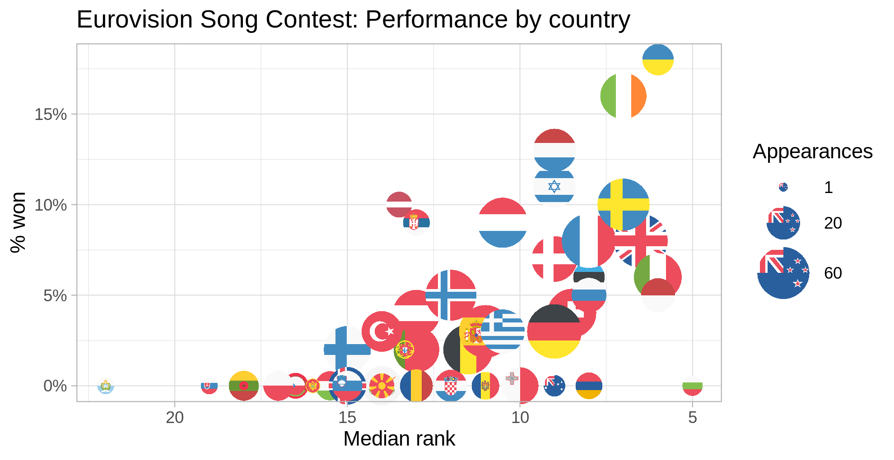
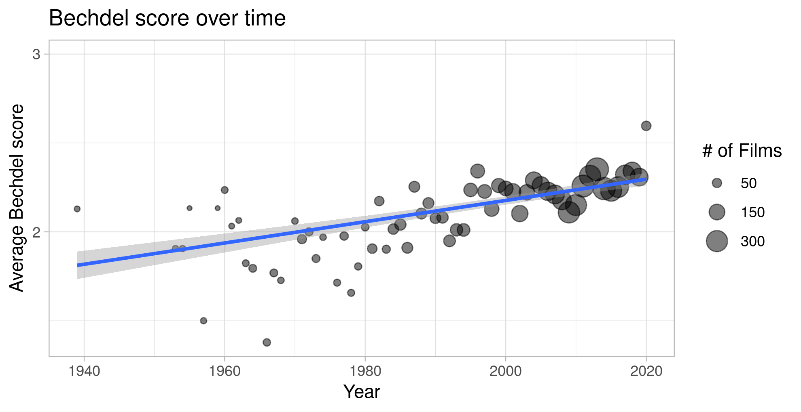
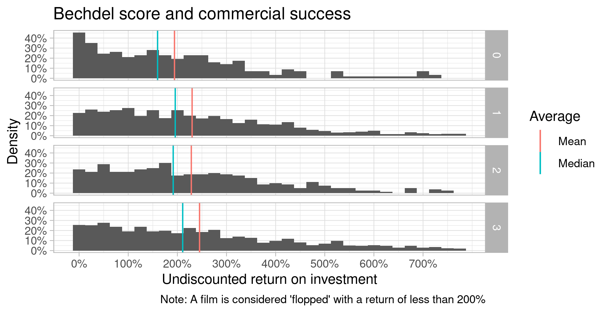

# Data analysis / visualisation bootcamp

Code from the LSE MISDI code bootcamp

## Eurovision Song Contest

## Bechdel test

By calculating the Return on Investment (gross income divided by budget) of films where the necessary data is available, we can estimate the profitability of films. As the films are grouped by their Bechdel scores, we see that films with higher scores are more commercially successful whereas films with lower scores are flops more often than not.

